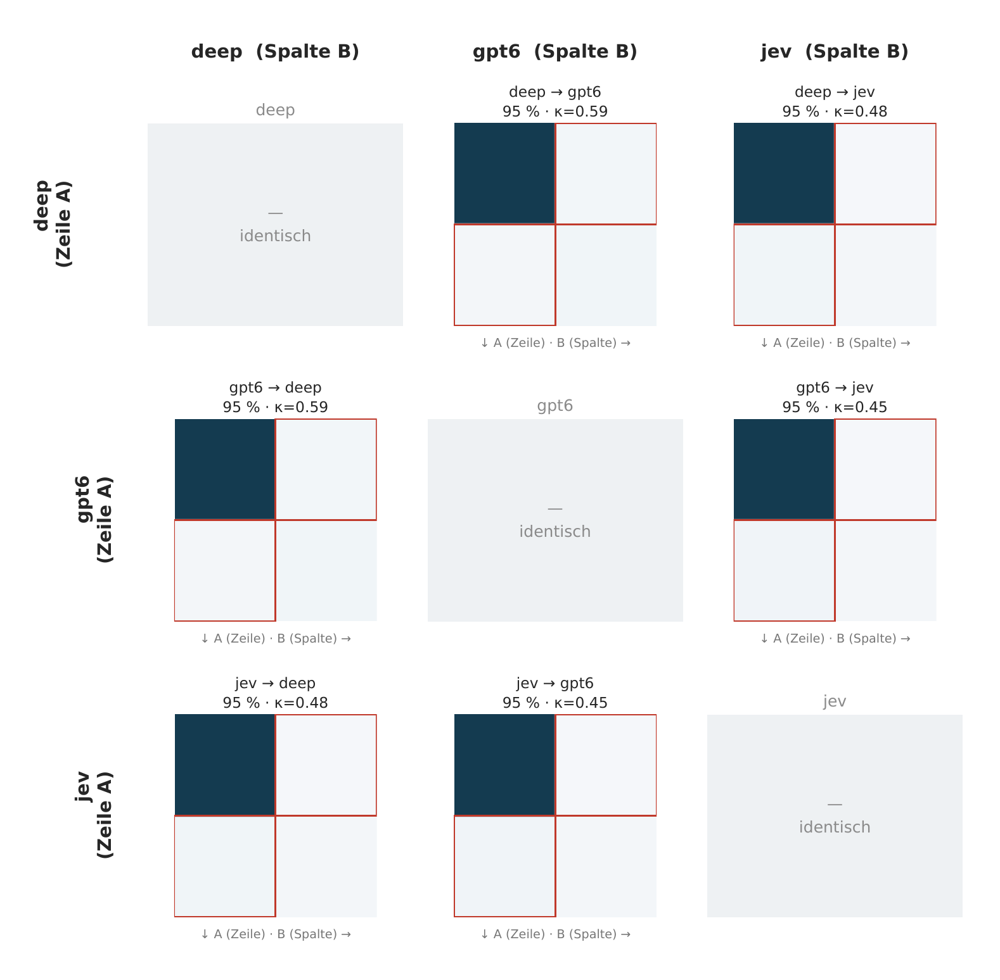
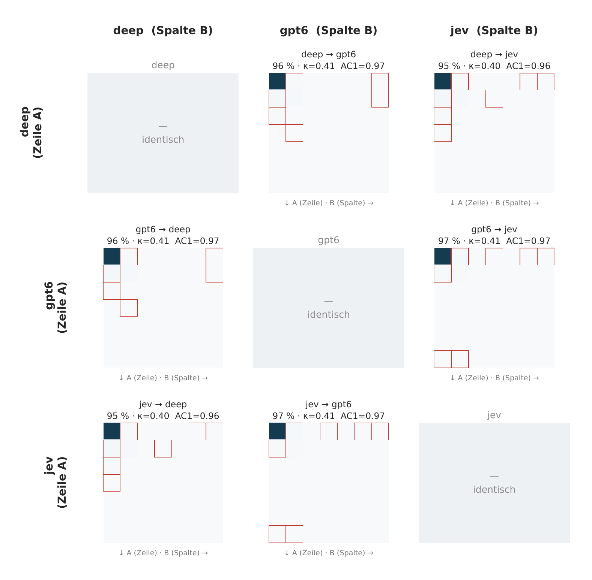
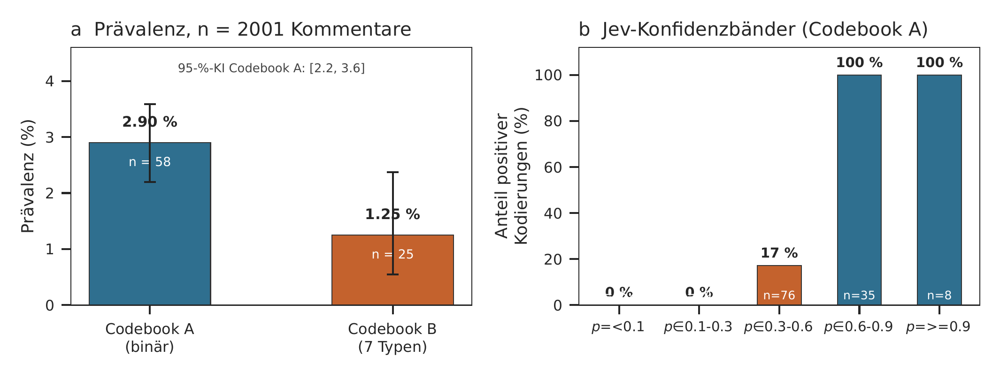

# Wie häufig ist psychologische Reaktanz auf TikTok — und wie schnell lässt sie sich erkennen?

<p class="subtitle">Ein LLM-Benchmark auf 2.001 Kommentaren unter deutschen Politiker:innen, mit zwei Codebooks, zwei Conditions und drei Modellen</p>

<p class="authors">Daniel Matter · Methodenteil · Arbeitsfassung vom 28. September 2026</p>

<p class="rule"></p>

<div class="abstract">

**Zusammenfassung.** Die Bedenkengeschichte politischer TikTok-Kommentare legt nahe, dass Reaktanz häufig sei. Zwei Benchmarks zeigen das Gegenteil. Auf 1.200 nach Partei geschichteten Kommentaren markieren die Modelle nach strenger, theoretisch verankerter Kodierung 2,8–6,6 % der Kommentare als Reaktanz; ein zweiter Lauf über 2.001 Kommentare, der nur den Kommentartext verwendet, ergibt 2,9 % (95-%-KI [2,2; 3,6]). Das Video-Transkript erhöht die Trefferquote nicht messbar. Die Erkennung ist billig und schnell: das Decision-API-Backend Jev antwortet in 0,46 s und kostet 0,061 US$ je 1.000 Kommentare und liefert als einziges kalibrierte Klassenwahrscheinlichkeiten — ein Schwellwert auf p(ja) hebt die Präzision von 9 % auf etwa 70 %. Die eigentliche Schwachstelle ist die Validität: eine manuelle Nachkodierung von 36 Positiven ergab 46 % Präzision (95 % bei Drei-Stimmen-Konsens, 25 % bei Einzelstimmen). Zwei daraus abgeleitete Schärfungen des Codebook — der Auslöser muss das Ziel der Reaktion sein, und Höflichkeitsmarker sind weder Auslöser noch Schutz — heben die Übereinstimmung zwischen beiden Codebooks von κ = 0,1–0,6 auf κ = 0,98. Unabhängig davon bleibt die Präzisionsfrage offen: der Test wurde vom Assistenten durchgeführt, nicht von geschulten Koder:innen.

<p class="keyword">**Schlüsselwörter:** psychologische Reaktanz; soziale Medien; LLM-Kodierung; TikTok; Validität; Güte; Bootstrap; Decision-API</p>

</div>

## 1 Daten und Methode

**Stichproben.** Zwei Stichproben aus demselben Korpus deutschsprachiger Kommentare unter Accounts deutscher Politiker:innen, geschichtet über die Partei des Accounts. Die Matrix-Stichprobe umfasst 1200 Kommentare aus 68 Accounts, 16 Parteien und 400 Videos; sie enthält durchgehend Video-Transkripte, weil Condition A sie benötigt. Die Large-Scale-Stichprobe umfasst 2001 Kommentare aus 114 Accounts und 16 Parteien und wird ausschließlich in Condition B (nur Kommentartext) kodiert. Beide Stichproben beschränken sich auf sichtbare Top-Level-Kommentare mit mindestens 25 Zeichen.

**Codebook A (binär).** Verlangt zwei Bedingungen zugleich: eine wahrgenommene Freiheitsbedrohung *und* eine affektive oder verhaltensbezogene Gegenreaktion. Maßgeblich ist die Decoding-Perspektive des Projekts: nicht ob eine Botschaft tatsächlich kontrollierend gemeint war, sondern ob die kommentierende Person sie so wahrnimmt.

**Codebook B (Typ).** Sieben disjunkte Labels, verdichtet aus den acht Archetypen der schriftlichen Reaktanz des Projekts (Anhang B). In der ersten Fassung enthielt es keine Verknüpfung zur Freiheitsbedrohung; die Modelle kodierten daraufhin gewöhnliche politische Kritik als Reaktanz (29–56 %). Zwei Gate-Fixes korrigierten das (Abschnitt 4.3).

**Conditions.** Condition A präsentiert Kommentar *und* Video-Transkript, Condition B nur den Kommentar. **Modelle.** Jev via Decision-API, GPT-6-Luna und DeepSeek-V4.1-Flash via Chat-Completion. Alle erhalten wortgleiche Instruktionen, Temperatur 0 und einen festen Seed.

**Umfang.** 14,400 Anfragen für die Matrix (2 Codebooks × 2 Conditions × 3 Modelle × 1200 Kommentare), 1.360 für zwei Validierungsexperimente und 4,002 für den Large-Scale-Lauf. Gesamtkosten 2,99 US$ von 3,00 US$ Budget.

## 2 Häufigkeit und Geschwindigkeit

Reaktanz ist selten. Codebook A mit Transkript ergibt 3.83–6.58 % (95-%-Bootstrap-KIs in Abb. 1, Tabelle A.2). Die Rangfolge der Modelle ist über beide Conditions hinweg stabil; Jev markiert am wenigsten.


**Abb. 1** Prävalenz nach Codebook und Condition mit 95-%-Bootstrap-Konfidenzintervallen (2.000 Resamples). Die gestrichelte Linie markiert den Mittelwert über Modelle.

Jev ist auf beiden Leistungsachsen Spitzenreiter: 0,46 s und 0,061 US$ je 1.000 Kommentare gegenüber mindestens 1,79 s und 0,126 US$ für das beste Chat-Modell. Entscheidend ist jedoch, dass Jev als einziges Backend kalibrierte Klassenwahrscheinlichkeiten liefert — ein Korrektiv, das sich in Abschnitt 4.4 als wirksam erweist.


**Abb. 4** Antwortzeit (a) und Kosten (b) je 1.000 Kommentare, Condition A. Kreise Codebook A, Quadrate Codebook B.

### 2.1 Der Video-Kontext trägt nichts bei

Der Verzicht auf das Transkript verschiebt die Prävalenz um weniger als zwei Prozentpunkte, für alle Modelle in dieselbe Richtung (Tabelle A.4). Nur bei Jev erreicht der Unterschied im exakten McNemar-Test das übliche Signifikanzniveau (p = 0,019) — die Richtung ist aber negativ: das Transkript erhöht die Trefferquote nicht, es senkt sie. Für eine Erkennungspipeline bleiben damit rund 900 zusätzliche Prompt-Tokens je Kommentar ohne messbaren Gewinn; der Kommentartext genügt.

## 3 Übereinstimmung zwischen Modellen

Die Modelle stimmen zu 94,6–95,1 % roh überein (Codebook A, Condition A). Cohen's κ liegt dagegen nur bei 0,45–0,59. Diese Diskrepanz ist kein Widerspruch, sondern ein Artefakt der Basisrate: bei 3–7 % Positiven sind sich alle Modelle auf der leichten Mehrheit einig, während die wenigen positiven Fälle auseinanderlaufen. Gwets AC1 — der prävalenzrobuste Koeffizient — liegt dagegen bei 0,94 und entspricht damit der Rohübereinstimmung. **Für diese Daten ist AC1 das angemessene Maß, nicht κ.** Abb. 3 stellt beide Größen deshalb auf getrennten y-Achsen dar: Prozent links, Koeffizienten auf einer 0–1-Skala rechts.


**Abb. 3** Rohübereinstimmung (%, linke Achse) und chance-bereinigte Koeffizienten (0–1, rechte Achse) für dieselben Modellpaare. Die Lücke zwischen beiden Größen ist das Basisraten-Artefakt; AC1 schließt sie.

Die vollständige Modellpaar-Matrix zeigt die Verwirrungsmatrizen für jedes Paar: Modell A in der Zeile, Modell B in der Spalte, quadratische Zellen, Diskrepanzen rot umrandet.


**Abb. 9** Verwirrungsmatrizen Modell × Modell, Codebook A, Condition A. Farbe zählt Kommentare; rot umrandete Felder sind Diskrepanzen.


**Abb. 10** Dieselbe Matrix für Codebook B (7 × 7 je Zelle). Die Besetzungen jenseits der Hauptklasse sind so dünn, dass einzelne Zellen nur ein bis zwei Kommentare enthalten.

## 4 Validität

Ein Prävalenzwert ist nur so belastbar wie die Kodierregeln, auf denen er beruht. Vier Prüfungen adressieren das.

### 4.1 Präzision der Positiverkennung

Von 119 mindestens von einem Modell markierten Positiven wurden 36 manuell nachkodiert, geschichtet nach Konsensgrad. Die geschätzte Präzision beträgt **46 %** — bei Drei-Stimmen-Konsens 92 %, bei Zweier-Mehrheit 50 %, bei Einzelstimmen 25 %.


**Abb. 2** Präzision nach Konsensgrad (a) und Verteilung aller 119 Positiven (b). Fehlerbalken: 95-%-KI auf Basis von n = 12 je Stratum.

Der Fehler ist strukturiert. Drei Muster dominieren: Empörung ohne Freiheitsbezug; Reaktion auf eine Sachbehauptung statt auf eine Einschränkung; benannter Auslöser ohne reaktantes Verhalten. Da zwei Drittel aller Positiven Einzelstimmen sind, übernimmt eine Pipeline, die nur ein Modell laufen lässt, zu rund zwei Dritteln Fehlalarme. Die in Abschnitt 2 berichteten Prävalenzen sind somit Obergrenzen; die Größenordnung überlebt, die exakten Prozentwerte nicht.

### 4.2 F1 gegen das Mehrheitsvote

Als referenzfreie Kennzahl dient F1 gegen das Mehrheitsvote der drei Modelle. Das ist kein Goldstandard, sondern misst, wie weit ein einzelnes Modell von der konsensualen Position entfernt ist. Bedingt durch die niedrige Prävalenz sind Recall und Precision stark gegenläufig: Jev erreicht die höchste Precision (0,79), verliert aber die Hälfte der positiven Fälle (Recall 0,50) und liegt damit im F1 hinter den Chat-Modellen.

Table: F1 der binären Kodierung (Codebook A) gegen das Mehrheitsvote, Condition B

| Modell | TP | FP | FN | Precision | Recall | F1 |
|---|---:|---:|---:|---:|---:|---:|
| deepseek-flash | 50 | 15 | 2 | 0.7692 | 0.9615 | **0.8547** |
| gpt-6-luna | 49 | 16 | 3 | 0.7538 | 0.9423 | **0.8376** |
| jev-1.13 | 26 | 7 | 26 | 0.7879 | 0.5 | **0.6118** |

### 4.3 Codebook B, geschärft

Die beiden in der Nachkodierung gefundenen Fehlermuster wurden in eine neue Fassung des Codebook B übersetzt, zusammen mit dem Befund aus dem Oberflächen-Experiment (Abschnitt 5). Gate 2 verlangt, dass der Auslöser das *Ziel* der Reaktion ist, nicht bloß ihr Thema: reacting auf eine Behauptung ist kein Reacten auf eine Einschränkung, und reacting auf das Video ist kein Reacten auf eine Bevormundung. Gate 3 legt fest, dass Höflichkeitsmarker weder Reaktanz auslösen noch sie aufheben — die in der deutschen Kommentarkultur verbreiteten Formeln sind bislang kein Merkmal von Reaktanz in der DemocraGPT-Systematik, sollten es aber sein. Beide Gates stehen in den Chat-Instruktionen *und* in den Jev-Kriterien, da die Decision-API nur letztere sieht.

Table: Übereinstimmung Codebook A × Codebook B vor und nach der Schärfung

| Fassung | Cond | n | beide reaktant | FP | FN | FP:TP |
|---|---|---:|---:|---:|---:|---:|
| B-gate-v2 | B | 1200 | 35 | 10 | 30 | 0.29 |
| B-gate-v2 | B | 1200 | 19 | 3 | 46 | 0.16 |
| B-gate-v2 | B | 1200 | 17 | 10 | 16 | 0.59 |
| **B-gate-v3** | B (n=2001) | 2001 | 23 | 2 | 35 | **0.09** |

Auf der Large-Scale-Stichprobe liegt die Rohübereinstimmung zwischen beiden Codebooks bei **98.15 %** (κ = 0.9815) — gegen κ = 0,1–0,6 mit der ungeschärften Fassung. Das Verhältnis falsch-positiver zu echter positiver Zuordnungen fällt von 13–20 (erste Fassung) über 0,1–0,6 (Gate v2) auf **0.09**. Die Schärfung hat die beiden Instrumente messbar zur Deckung gebracht.

### 4.4 Konfidenz als Korrektiv

Weil Jev Wahrscheinlichkeiten liefert, lässt sich die Präzision gegen eine Schwelle steuern. Gegen das Mehrheitsvote der beiden Chat-Modelle steigt die Präzision von 9 % bei einer Schwelle von 0,05 auf rund 70 % bei 0,6 — bei einer Abdeckung von nur 2.8 % der Kommentare. Die Präzision ist damit keine Eigenschaft des Modells, sondern eine Eigenschaft der Schwelle.


**Abb. 7** Kalibrierung der Jev-Wahrscheinlichkeit gegen das Mehrheitsvote der Chat-Modelle (a) und Precision-Trade-off über Schwellwerte (b).

## 5 Zwei Validierungsexperimente

Die Kernfrage, ob das Instrument die Konstruktion oder die Oberfläche misst, lässt sich mit zwei kleinen Zusatzläufen prüfen.

**Wiederholungsstabilität.** Identische Eingabe, zweimal kodiert, auf vorhergesampelten Positiven und einer Negativkontrolle: 100.0% Stabilität bei der Kontrolle, 96.94% bei den Positiven, 98.47% gesamt. Die Flips liegen an der Grenze, wo p(ja) ≈ 0,31. Das Instrument ist intern konsistent. Wird das Transkript hinter statt vor den Kommentar gestellt, bleibt das Label unverändert.

**Oberflächenrobustheit.** Drei deterministische, sinnerhaltende Umformungen des Kommentars: Betonung entfernt (96.3% unverändert), Füllwörter entfernt (92.59% unverändert) und eine neutrale Höflichkeitsrahmenung ergänzt (77.78% unverändert). Betonung und Füllwörter verändern das Ergebnis kaum; die **Höflichkeitsrahmenung kippt dagegen 22–38 % der positiven Kodierungen**. Das ist kein Fehler, sondern ein Hinweis darauf, dass das Codebook an dieser Grenze theoretisch nicht scharf genug war — die Konsequenz ist Gate 3 in Abschnitt 4.3.


**Abb. 8** Oberflächenrobustheit (a) und Wiederholungsstabilität (b), Jev, Codebook A, Condition A.

## 6 Large-Scale-Lauf: 2.001 Kommentare, nur Kommentartext

Mit dem geschärften Codebook und ohne Transkript ergibt der Lauf über 2001 Kommentare eine Prävalenz von **2.9 %** (95-%-KI [2.2; 3.6]). Codebook B liegt mit 1.25 % darunter und verteilt die Positiven auf {'keine_reaktanz': 1976, 'konfrontation_angriff': 18, 'vermeidung_rueckzug': 6, 'reflektierte_rechtfertigung': 1}.


**Abb. 11** Prävalenz beider Codebooks mit Bootstrap-KI (a) und die Konfidenzbänder der Decision-API (b): unter p = 0,1 wird nie positiv kodiert, über p = 0,6 immer. Die API verhält sich effektiv wie ein Zwei-Zustands-Detektor.

Table: Konfidenzbänder der Decision-API, Codebook A, n = 2.001

| Band p(ja) | n | positiv | Anteil % |
|---|---:|---:|---:|
| 0.1-0.3 | 191 | 0 | 0.0 |
| 0.3-0.6 | 76 | 13 | 17.11 |
| 0.6-0.9 | 35 | 35 | 100.0 |
| <0.1 | 1521 | 0 | 0.0 |
| >=0.9 | 8 | 8 | 100.0 |

Die Bänder sind scharf getrennt: 1.521 Kommentare liegen unter p = 0,1 und werden ausnahmslos als `nein` kodiert, 43 Kommentare über p = 0,6 und ausnahmslos als `ja`. Die Decision-API liefert also keine graduelle Unsicherheit, sondern eine quasi-binäre Antwort mit wenigen Übergangsfällen. Das ist für eine Kaskaden-Architektur günstig, erschwert aber die Kalibrierung eines Schwellwerts, weil das  informative Signal in einem schmalen Band liegt.

## 7 Diskussion

**Prävalenz, nicht Wirkung.** Reaktanz ist im untersuchten Korpus selten. Das ist kein Defekt, sondern ein Befund — und er verschiebt den Aufwand: Die methodische Arbeit verschiebt sich von der Häufigkeitsmessung zur Validierung. Bei 3 % Prävalenz ist die entscheidende Frage nicht, welches Modell häufiger `ja` sagt, sondern welches Label überhaupt trägt.

**Der Kontextaufwand ist vermeidbar.** Weder Transkript noch Video beeinflussen die Erkennung nennenswert. Für eine Pipeline über 6,7 Mio. Kommentare ist das die wichtigste praktische Nachricht: der Kommentartext genügt, und die Transkripte bleiben für die Interventionsseite des Projekts verfügbar, ohne für die Messseite gebraucht zu werden.

**Kaskaden statt Monolithen.** Billiger Jev-Pass mit Konfidenzschwelle, Eskalation der Restfälle auf ein stärkeres Modell — verspricht bessere Präzision bei vertretbaren Kosten und nutzt exakt den Informationsvorteil, den nur die Decision-API liefert.

**Goldstandard fehlt weiterhin.** Der Notions-Export enthält kein Annotation-Schema und kein Intercoder-Protokoll. Die Nachkodierung in Abschnitt 4.1 und die F1-Werte in Abschnitt 4.2 sind ein erster Schritt, wurden jedoch vom Assistenten durchgeführt und ersetzen keine geschulte Doppelkodierung mit Trainingsphase. Die κ- und AC1-Werte messen Konsistenz untereinander, nicht Korrektheit gegen menschliches Kodieren. Bis dahin sind alle Präzisionsangaben als Größenordnung zu lesen.

## 8 Limitationen

- **Stichprobe.** Für die Methodenfrage gebaut, nicht als repräsentative Stichprobe: Kommentare unter 25 Zeichen, Antwort-Kommentare und nicht-öffentliche Kommentare ausgeschlossen. Parteizellen zu klein für Gruppenvergleiche.
- **Transkriptqualität.** Automatische Spracherkennung mit erheblichen Fehlern; Condition A leidet darunter stärker als Condition B.
- **Präzisionsschätzung.** 36 Fälle, ein Kodierer, der Assistent.
- **Referenz für F1 und κ.** Das Mehrheitsvote ist keine Ground Truth.
- **Modelle.** Drei Flash-Modelle eines Anbieters.
- **Schwelle.** Die Konfidenzbänder sind zu scharf getrennt, als dass der im Abschnitt 4.4 kalibrierte Schwellwert ohne Test auf neuen Daten übertragbar wäre.

---

# Anhang A · Detaillierte Tabellen

## A.1 Stichproben

Table: Charakteristika der beiden Stichproben

| Merkmal | Matrix (1.200) | Large-Scale (2.001) |
|---|---:|---:|
| Kommentare | 1200 | 2001 |
| Accounts | 68 | 114 |
| Parteien | 16 | 16 |
| Videos | 400 | 667 |
| Bedingungen | A und B | nur B |
| Codebook-Version | B-gate-v2 | B-gate-v3 |

Table: Parteienverteilung der Large-Scale-Stichprobe

| Partei | n | Partei | n |
|---|---:|---|---:|
| AfD | 327 | FDP | 318 |
| CDU | 252 | Grüne | 240 |
| CSU | 228 | Linke | 192 |
| SPD | 165 | BSW | 75 |
| FreieWähler | 63 | parteilos | 63 |
| ÖVP | 21 | Tierschutz | 21 |
| ödp | 12 | ÖDP | 9 |
| unabhängig | 9 | DiePartei | 6 |

## A.2 Prävalenz mit Bootstrap-KI

Table: Prävalenz Codebook A mit 95-%-Bootstrap-KI (2.000 Resamples)

| Cond | Modell | n | Prävalenz % | 95-%-KI |
|---|---|---:|---:|---|
| A | deepseek-flash | 1200 | 6.17 | [4.833, 7.5] |
| A | gpt-6-luna | 1200 | 6.58 | [5.25, 8.0] |
| A | jev-1.13 | 1200 | 3.83 | [2.833, 5.0] |
| B | deepseek-flash | 1200 | 5.42 | [4.167, 6.75] |
| B | gpt-6-luna | 1200 | 5.42 | [4.167, 6.667] |
| B | jev-1.13 | 1200 | 2.75 | [1.915, 3.75] |

## A.3 Vollständige Ergebnismatrix

Table: Alle 12 Zellen der Matrix

| Codebook | Cond | Modell | Parse % | n | reaktant | Prävalenz % | Ø Latenz s | $/1.000 |
|---|---|---|---:|---:|---:|---:|---:|---:|
| A | A | deepseek-flash | 100.0 | 1200 | 74 | 6.17 | 4.085 | 0.3324 |
| A | A | gpt-6-luna | 100.0 | 1200 | 79 | 6.58 | 2.114 | 0.1473 |
| A | A | jev-1.13 | 100.0 | 1200 | 46 | 3.83 | 0.464 | 0.0611 |
| A | B | deepseek-flash | 100.0 | 1200 | 65 | 5.42 | 3.63 | 0.2432 |
| A | B | gpt-6-luna | 100.0 | 1200 | 65 | 5.42 | 1.898 | 0.1131 |
| A | B | jev-1.13 | 100.0 | 1200 | 33 | 2.75 | 0.349 | 0.052 |
| B | A | deepseek-flash | 100.0 | 1200 | 41 | 3.42 | 3.976 | 0.3036 |
| B | A | gpt-6-luna | 100.0 | 1200 | 21 | 1.75 | 2.073 | 0.108 |
| B | A | jev-1.13 | 100.0 | 1200 | 29 | 2.42 | 0.348 | 0.1117 |
| B | B | deepseek-flash | 100.0 | 1200 | 45 | 3.75 | 3.924 | 0.2381 |
| B | B | gpt-6-luna | 100.0 | 1200 | 22 | 1.83 | 2.096 | 0.0732 |
| B | B | jev-1.13 | 100.0 | 1200 | 27 | 2.25 | 0.35 | 0.1051 |

## A.4 Condition A vs. B

Table: Gepaarte Tests Condition A gegen Condition B

| Codebook | Modell | n | Rohüb. % | κ | AC1 | Präv. A % | Präv. B % | diskordant | McNemar p |
|---|---|---:|---:|---:|---:|---:|---:|---:|---:|
| A | deepseek-flash | 1200 | 94.25 | 0.4732 | 0.9355 | 6.17 | 5.42 | 39/30 | 0.335558 |
| A | gpt-6-luna | 1200 | 95.83 | 0.6308 | 0.953 | 6.58 | 5.42 | 32/18 | 0.064909 |
| A | jev-1.13 | 1200 | 97.75 | 0.6469 | 0.976 | 3.83 | 2.75 | 20/7 | 0.019157 |
| B | deepseek-flash | 1200 | 97.0 | 0.5682 | 0.9678 | — | — | — | — |
| B | gpt-6-luna | 1200 | 99.0 | 0.7162 | 0.9896 | — | — | — | — |
| B | jev-1.13 | 1200 | 98.67 | 0.7087 | 0.986 | — | — | — | — |

## A.5 Modell-Übereinstimmung

Table: Alle Paare mit drei Kennzahlen

| Codebook | Cond | Modell A | Modell B | n | Roh % | κ | AC1 |
|---|---|---|---|---:|---:|---:|---:|
| A | A | deepseek-flash | gpt-6-luna | 1200 | 95.08 | 0.5882 | 0.9442 |
| A | A | deepseek-flash | jev-1.13 | 1200 | 95.0 | 0.4752 | 0.9448 |
| A | A | gpt-6-luna | jev-1.13 | 1200 | 94.58 | 0.4535 | 0.9399 |
| A | B | deepseek-flash | gpt-6-luna | 1200 | 97.0 | 0.7072 | 0.9666 |
| A | B | deepseek-flash | jev-1.13 | 1200 | 95.83 | 0.4705 | 0.9548 |
| A | B | gpt-6-luna | jev-1.13 | 1200 | 95.67 | 0.4493 | 0.953 |
| B | A | deepseek-flash | gpt-6-luna | 1200 | 97.0 | 0.4075 | 0.9684 |
| B | A | deepseek-flash | jev-1.13 | 1200 | 96.58 | 0.4003 | 0.9638 |
| B | A | gpt-6-luna | jev-1.13 | 1200 | 97.58 | 0.41 | 0.9748 |
| B | B | deepseek-flash | gpt-6-luna | 1200 | 97.25 | 0.4962 | 0.9709 |
| B | B | deepseek-flash | jev-1.13 | 1200 | 96.92 | 0.4737 | 0.9673 |
| B | B | gpt-6-luna | jev-1.13 | 1200 | 97.58 | 0.3971 | 0.9748 |

## A.6 Präzisions-Audit

Table: Präzision je Stratum

| Stratum | n | Präzision % |
|---|---:|---:|
| 3 von 3 Modellen | 12 | 92 |
| 2 von 3 Modellen | 12 | 50 |
| 1 von 3 Modellen | 12 | 25 |
| **gewichtet** | 119 | **46** |

Table: Die 36 nachkodierten Positiven

| Stratum | Partei | Verdikt | Beispiel | Begründung |
|---:|---|---|---|---|
| 3/3 | CSU | ja | Man sollte das Problem bekämpfen und jeden der auffällig ist ausweisen. Das was er da sagt das ist ein Üb | Rahmen als Überwachungsstaat = wahrgenommene Kontrollbedrohung (A) |
| 3/3 | ÖVP | ja | wir sollen masken tragen und politiker dürfen alles a frechheit is des | Maskenpflicht als Eingriff in den Körper benannt = Kontrollbedrohung (A) |
| 3/3 | Grüne | ja | Ach jetzt macht euch doch nicht dauernd ins Hemd wegen so einem Scheiss, daneben ist nur der hochgekackte | Video beschämt die Zuschauer → Normdruck + Identitätsbedrohung (C/D). Gutes Beispiel. |
| 3/3 | ÖVP | ja | Wenn du drei 1.90 große Streifen-Polizisten vor meine Haustüre schickst überleg ichs mir.. | Polizei vor der Tür gegen Impfpflicht = Bedrohungsrahmen, Verweigerung (A) |
| 3/3 | AfD | ja | nix werde ich, meine Sprache bleibt altdeutsch und fertig | Weist aufgezwungene Terminologie zurück → Identitätsbedrohung (D), schwach aber vertr |
| 3/3 | FreieWähler | ja | dafür haben wir jetzt ganz viel Impfstoff mit dem wir die Leute Zwangsimpfen können. Danke Politiker | „Zwangsimpfen“ explizit benannt = Kontrollbedrohung (A) + Sarkasmus |
| 3/3 | ÖVP | ja | Es gibt mindestens 5 andere arten corona zu bekämpfen außer der Impfung... warum hört man davon nichts? W | Wirft der Impfpolitik Gewinnmotive vor = wahrgenommene Manipulation (B) |
| 3/3 | CDU | nein | Hahahaha hinter de Mauer !????? Never. | Nicht deutbares Fragment, keine rekonstruierbare Reaktanz |
| 3/3 | Grüne | ja | Der Zimmerman hat ein großes Loch in jedem Zimmer hinterlassen und jeder kann gehen wenn es ihm nicht pas | Weist den Beschämungsrahmen zurück, nennt den Ausstieg = Normdruck (C) |
| 3/3 | SPD | ja | Jetzt ist es das Wachstum,ich denke es ist Putin,der Klimawandel,die AFD, Trump,der Ukrainekrieg,ihre Fön | „total verblödet“ = Identitäts-/Würdeangriff (D) |
| 3/3 | CDU | ja | Das würde mich sooooo nerven. Geht mir bitte nicht jede Minute damit auf den Keks - ich bin beim Fußball  | Message Fatigue, „jede Minute auf den Keks“ = Auslöserdimension E |
| 3/3 | CDU | ja | Wie jemand seine Zeit nutzt ist erstmal egal. Wenn jemand glücklich damit ist nichts anderes zu tun außer | Gegenargument gegen bevormundende Screen-Time-Moralisierung (C) |
| 2/3 | Grüne | nein | *Friedrich Merz will Familien in die Obdachlosigkeit schicken.* wenn du so verzweifelt bist dass dir einf | Zustimmung / Wahlempfehlung |
| 2/3 | CSU | nein | Wen das Demokratische Flicht ist dann sollte auch Stimen Von Volker AKZEPTIEREN. | Angriff auf eine rivalisierende Partei, keine Autonomiebedrohung |
| 2/3 | Grüne | nein | Grüne Kriegsfetischisten dürfen nie wieder in Regierungsverantwortung kommen bevor unser Land komplett ze | Gewöhnliche Sachkritik (Rundfunkgebühren) |
| 2/3 | unabhängig | nein | Klimawandel war schon immer! Wir haben Null Einfluss auf das Wetter. Ihr solltet sich anderer Wissenschaf | Beleidigung von Parteien, kein Rahmen einer Freiheitsbedrohung |
| 2/3 | CSU | ja | Warum sorgen sie nicht das Amerikanische Armee Deutschland verlässt. Wie lange sollen wir Kolonie den USA | „plumpe Framing“ benennt Framing/Manipulation (B) — Grenzfall, aber der Auslöser wird |
| 2/3 | AfD | ja | @💙💙💙Endspurt 💙💙.. 14.09.25 wählen 🗳️gehen es geht um euch und keiner hat es Verdient sich weiter von CDU/ | Verweigert eine Impfpflicht = Lehrbuchfall des Boomerang-Effekts (A) |
| 2/3 | FDP | ja | Das ist doch der erste Aufruf Plattformen, wie diese zu kontrollieren und zu verbieten. Nach der COVID Ge | Weist die Norm der Wahlpflicht zurück = Normdruck (C) |
| 2/3 | CDU | nein | Na dann lassen Sie sich mal Impfen. Und ich bitte darum Sie zuerst. Am besten als Testperson. Mein Leben  | Beiläufige Bemerkung, keine Bewertung einer Einschränkung |
| 2/3 | CDU | ja | Beide Stimmen für die Grünen 💚 | „totalitärer Staat“ + Weigerung, sich spalten zu lassen = Identität/Würde (D) |
| 2/3 | unabhängig | nein | Immer wieder erfrischend dieses plumpe Framing. | Spott, keine Wiederherstellung von Autonomie |
| 2/3 | Linke | ja | 💙 jetzt erst recht, nur noch AFD 💙 | Nimmt aus Prinzip ein Bußgeld an = klassische Reaktanz-Bewältigung (A) |
| 2/3 | FDP | ja | eyyyy kann diese Reichenpartei uns nicht bitte endlich in Ruhe lassen???? | Benennt „kontrollieren und zu verbieten“ = Kontrollbedrohung (A) |
| 1/3 | AfD | nein | Herr Becker Ich bin Afd Wähler und freue mich auf solch einer Partei die versucht für das Volk zu sein un | Selbstauskunft + Bitte um Rat; keine Reaktion auf eine Einschränkung im Video |
| 1/3 | BSW | nein | immer noch Propagandabegriffe wie "definitiv rechtsextremistisch" und "Nazis". Erstmal sollte der BSW geh | Kritik an der Wortwahl, keine Autonomiebedrohung |
| 1/3 | Grüne | ja | Sind das jetzt auch gekaufte Leute 🤔🤔🤔 | Verdacht auf gekaufte Abgeordnete = wahrgenommene Manipulation (B). Grenzfall. |
| 1/3 | FDP | nein | Beide Stimmen am 23.02.2025 für die AFD 💙 💙 💙 💙 💙 | Wahlempfehlung |
| 1/3 | Grüne | nein | Meine Gemeinde in Sachsen Anhalt ist bereits GRÜNEN frei!! Weck mit diesen faschistischrn Subjekten und d | Reine Aggression, kein Einschränkungsrahmen |
| 1/3 | Grüne | nein | Selbstbestimmungsgeset!?! Nicht reden handeln. Jetzt. Handeln! | Stimmt zu und fordert Handeln; Gegenteil von Reaktanz |
| 1/3 | AfD | nein | Bin für Abtreibung von Politikern, Beamten, Anwälten, Richtern, Ärzten und illegalen Einwanderern/Invasor | Drohung gegen andere, keine Reaktanz der kommentierenden Person |
| 1/3 | BSW | ja | richtig so. Und die wollen alles verbieten 🤣. Das ist grünen Logik | „die wollen alles verbieten“ = Kontrollbedrohung (A). Grenzfall. |
| 1/3 | Linke | ja | Ihr seid doch die Kinder und Enkel der SED? Habt Ihr die Maueropfer und Häftlinge schon entschädigt? | SED/Maueropfer-Konfrontation = Identität/Status (D). Grenzfall. |
| 1/3 | CSU | nein | Nimalscdu oder andere drei. | Sinnloses Fragment |
| 1/3 | Grüne | nein | Zum ersten Gas aus Russland wäre eine gute Möglichkeit, günstige Energie für Deutschland zu erhalten. Rus | Sachliche Kritik an den Aussagen eines Politikers |
| 1/3 | Grüne | nein | Warum sollen wir kein Gas kaufen. Günstig ist gut für Deutschland. Es gibt keinen Krieg aus Russland. Wir | Gegenargument zur Gasfrage, keine Bewertung einer Einschränkung |

## A.7 Validierungsexperimente

Table: Wiederholungsstabilität und Positionsrobustheit

| Stratum | n Paare | Stabilität % | Flips | Positions-Üb. % | Ø p(ja) |
|---:|---:|---:|---:|---:|---:|
| 3 | 27 | 100.0 | 0 | 100.0 | 0.7678 |
| 2 | 26 | 92.31 | 2 | 100.0 | 0.3277 |
| 1 | 45 | 97.78 | 1 | 95.56 | 0.3062 |
| 0 | 98 | 100.0 | 0 | 100.0 | 0.0692 |

Table: Oberflächenrobustheit (Anteil unveränderter Kodierungen)

| Stratum | n | Betonung weg | Höflichkeit | Füllwörter weg | alle drei |
|---:|---:|---:|---:|---:|---:|
| 3 | 27 | 96.3 | 77.78 | 92.59 | 77.78 |
| 2 | 26 | 92.31 | 61.54 | 88.46 | 61.54 |
| 1 | 35 | 97.14 | 77.14 | 88.57 | 68.57 |
| 0 | 105 | 100.0 | 98.1 | 100.0 | 98.1 |

## A.8 Schwellwert-Sweep

Table: Precision-Trade-off über Schwellwerte (Referenz: Mehrheitsvote der Chat-Modelle)

| Schwelle | markiert | Abdeckung % | TP | FP | FN | Precision | Recall |
|---:|---:|---:|---:|---:|---:|---:|---:|
| 0.05 | 495 | 41.25 | 45 | 450 | 2 | 0.091 | 0.957 |
| 0.1 | 297 | 24.75 | 40 | 257 | 7 | 0.135 | 0.851 |
| 0.2 | 161 | 13.42 | 39 | 122 | 8 | 0.242 | 0.83 |
| 0.3 | 102 | 8.5 | 34 | 68 | 13 | 0.333 | 0.723 |
| 0.4 | 60 | 5.0 | 30 | 30 | 17 | 0.5 | 0.638 |
| 0.5 | 49 | 4.08 | 28 | 21 | 19 | 0.571 | 0.596 |
| 0.6 | 33 | 2.75 | 23 | 10 | 24 | 0.697 | 0.489 |
| 0.7 | 24 | 2.0 | 17 | 7 | 30 | 0.708 | 0.362 |
| 0.8 | 15 | 1.25 | 11 | 4 | 36 | 0.733 | 0.234 |
| 0.9 | 6 | 0.5 | 5 | 1 | 42 | 0.833 | 0.106 |

---

# Anhang B · Codebook

Vollständiger Wortlaut in `src/codebook.py`, Provenienz jeder Formulierung in `docs/codebook_sources.md`.

**Codebook A — binär.** `ja`, wenn *beides* vorliegt: (1) eine wahrgenommene Einschränkung der eigenen Freiheit (Auslöserdimensionen A–D) und (2) eine affektive oder verhaltensbezogene Gegenreaktion. Sonst `nein`.

**Codebook B — sieben Typen.** Die acht Archetypen der DemocraGPT-Typologie, zusammengefasst zu disjunkten Labels:

| Label | Zusammengeführte Archetypen |
|---|---|
| `konfrontation_angriff` | Destruktiver + Konstruktiver Angreifer |
| `ablenkung_whataboutism` | Aggressiver Ablenker + Ablenkungs-Stratege |
| `delegierung_hilflosigkeit` | Hilfloser Delegierer |
| `vermeidung_rueckzug` | Vermeidender Rechtfertiger |
| `reflektierte_rechtfertigung` | Reflektierter Rechtfertiger |
| `konstruktive_kritik` | Konstruktiver Kritiker |
| `keine_reaktanz` | — |

**Gates.**

- *Gate 1 (v2):* Die wahrgenommene Freiheitsbedrohung ist Vorbedingung, geprüft vor der Labelwahl. Kontrollfrage: Wäre die Person noch wütend, wenn niemand ihre Freiheit einschränkte?
- *Gate 2 (v3):* Der Auslöser muss das Ziel der Reaktion sein. reacting auf eine Behauptung ist kein Reacten auf eine Einschränkung; reacting auf das Video ist kein Reacten auf eine Bevormundung.
- *Gate 3 (v3):* Höflichkeitsmarker sind weder Auslöser noch Schutz. Die in der deutschen Kommentarkultur verbreiteten Formeln sind in der DemocraGPT-Systematik bislang kein Reaktanz-Merkmal — Gate 3 begründet sie als Merkmal.

Alle Gates stehen in den Chat-Instruktionen **und** in den Jev-Kriterien, da die Decision-API nur die Kriterien sieht. `CODEBOOK_VERSION` in `run_benchmark.py` muss bei jeder Änderung hochgezählt werden.

---

# Anhang C · Reproduktion

```bash
git clone https://github.com/DanielMatterTUM/democragpt-experiments
cd democragpt-experiments
pip install -r requirements.txt -r requirements-analysis.txt
export OPENROUTER_API_KEY=...

python3 src/build_dataset.py --target 1200 --n-accounts-per-party 8
python3 src/run_benchmark.py \
    --models deepseek-v4.1-flash gpt-6-luna jev-1.13 \
    --codebooks A B --conditions A B --workers 12 --run-name full
python3 src/dedup_one.py requests_full
python3 src/analyze.py && python3 src/analyze_extended.py && python3 src/analyze_f1.py
python3 src/exp_reliability.py 45 && python3 src/exp_paraphrase.py 35
python3 src/make_figures_sci.py
python3 src/make_fig3_dualaxis.py && python3 src/make_heatmap_matrix.py
python3 src/make_fig11.py
python3 src/build_report_paper.py
node tools/md2pdf.js results/REPORT.md results/REPORT.pdf
```

---

# Literatur

<div class="refs">
<div>Brehm, J. W. (1966). <em>A Theory of Psychological Reactance.</em> Academic Press.</div>
<div>Dillard, J. P., & Shen, L. (2005). The psychological reactance scale. <em>Communication Monographs, 72</em>(2), 144–168.</div>
<div>Dillard, J. P., et al. (2023). Communication, reactance, and the escalation spiral. <em>Review of Communication</em>.</div>
<div>Hajek, K. V. (laufende Dissertation). Reaktanz-Encoding und -Decoding. bidt / TU München. Notions-Export, 28.09.2026.</div>
<div>Hajek, K. V., & Kobilke, L. (2026). LLMs und Reaktanz: Masterprojekt. Präsentation KIDEM, 31.03.2026.</div>
<div>Mühlberger, H., & Jonas, J. (2019). </div>
<div>OpenRouter. <em>Jev Decision API — Classification Example.</em> Abruf 28.09.2026.</div>
<div>Rains, F. A. (2013). Reactance theory and audience oppositional behavior. <em>Communication Monographs, 80</em>(2), 150–168.</div>
<div>Ratcliff, V. E. (2019). </div>
</div>