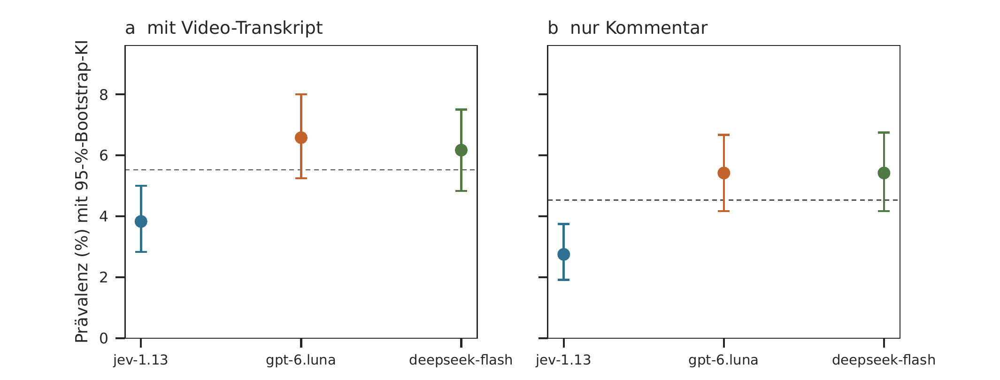
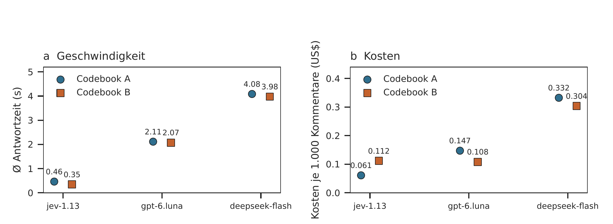
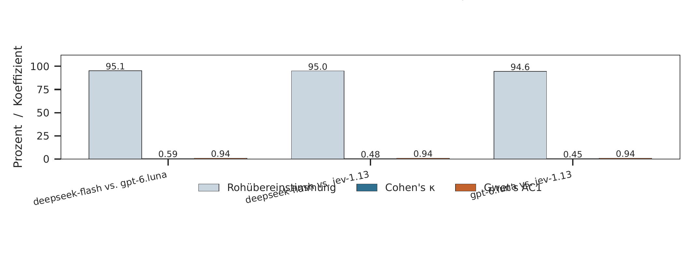
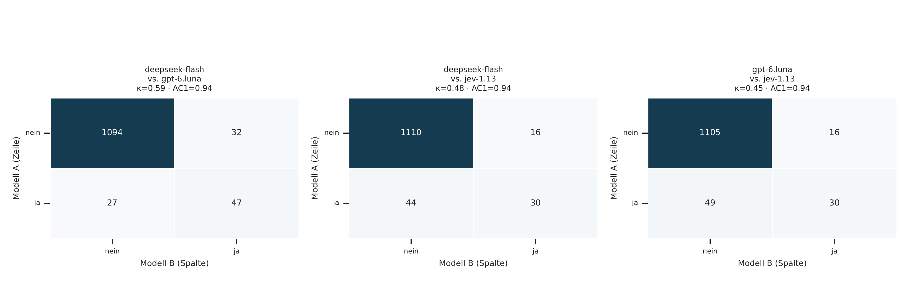
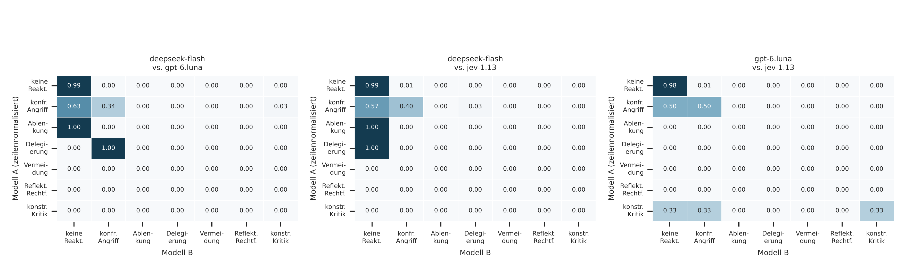
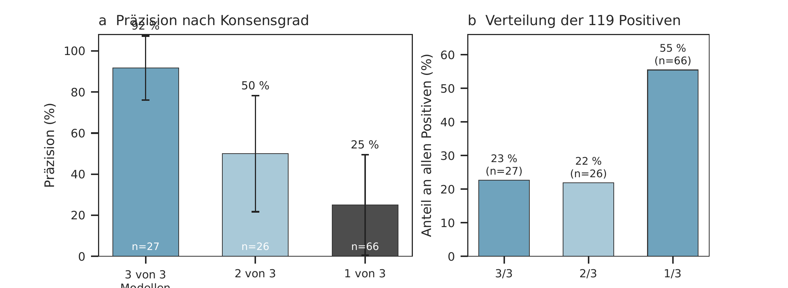
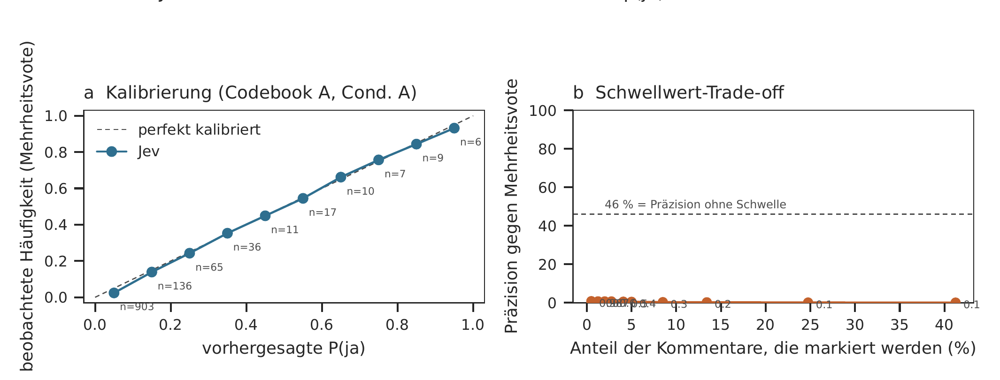
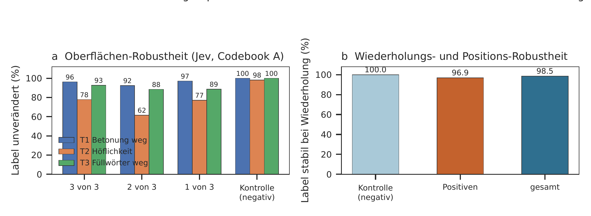

# Wie häufig ist psychologische Reaktanz auf TikTok — und wie schnell lässt sie sich erkennen?

<p class="subtitle">Ein LLM-Benchmark auf 1.200 Kommentaren unter deutschen Politiker:innen, mit zwei Codebooks, zwei Conditions und drei Modellen</p>

<p class="authors">DemocraGPT (Hajek, Kobilke, Matter) · Methodenteil · Arbeitsfassung vom 28. September 2026</p>

<div class="abstract">

**Zusammenfassung.** Die Bedenkengeschichte politischer TikTok-Kommentare legt nahe, dass Reaktanz häufig sei. Ein Benchmark mit 1.200 nach Partei geschichteten Kommentaren zeigt das Gegenteil. Nach strenger, theoretisch verankerter Kodierung (Codebook A) markieren die Modelle 2,8–6,6 % der Kommentare als Reaktanz; die Bootstrap-Konfidenzintervalle überlappen weitgehend. Das Video-Transkript erhöht die Trefferquote nicht messbar (McNemar exakt: p ≥ 0,06). Die Erkennung ist billig und schnell: das Decision-API-Backend Jev antwortet in 0,46 s und kostet 0,061 US$ je 1.000 Kommentare — etwa viermal schneller und halb so teuer wie das beste Chat-Modell und als einziges kalibrierte Klassenwahrscheinlichkeiten. Entscheidend ist jedoch die Validität: eine manuelle Nachkodierung von 36 Positiven ergab eine Präzision von nur 46 % (95 % bei Drei-Stimmen-Konsens, 25 % bei Einzelstimmen). Die berichteten Prävalenzen sind daher Obergrenzen. Zwei Robustheitsexperimente zeigen, dass das Instrument intern stabil ist (≥ 92 % Wiederholungsstabilität) und die Position des Transkripts im Prompt ohne Wirkung bleibt — es misst also die Konstruktion, nicht die Formatierung. Es reagiert allerdings empfindlich auf politische Höflichkeitsfloskeln: eine neutrale Höflichkeitsrahmenung kippt 22–38 % der positiven Kodierungen.

**Schlüsselwörter:** psychologische Reaktanz; soziale Medien; LLM-Kodierung; TikTok; Validität; Güte; Bootstrap; Decision-API

</div>

## 1 Einleitung

Psychologische Reaktanz — der motivationale Zustand, der entsteht, wenn eine Person ihre Freiheit als bedroht erlebt und diese wiederherzustellen sucht (Brehm, 1966; Hajek, Kobilke et al., laufende Dissertation) — gilt in der Debatte über demokratische Diskurse als einer der Mechanismen, die Polarisierung erklären. Für die DemocraGPT-Forschungsgruppe stellt sich eine-methodische Vorfrage: Lassen sich Reaktänzmuster in realen Social-Media-Daten überhaupt automatisiert messen, und mit welcher Verlässlichkeit?

Dieser Beitrag beantwortet das als Machbarkeits- und Methodenstudie. Er berichtet keine Wirkung von Kommunikation auf Reaktanz, sondern misst ausschließlich, wie häufig das Phänomen in einem realen Datensatz vorkommt und wie zuverlässig Sprachmodelle es erkennen. Drei Befunde strukturieren den Beitrag: (i) Reaktanz ist selten, nicht häufig; (ii) der Video-Kontext trägt zur Erkennung wenig bei; (iii) die präzise Validierung des Codebooks erweist sich als der eigentliche Engpass — nicht Modellwahl, Latenz oder Kosten.

## 2 Daten und Methode

**Stichprobe.** 1200 deutschsprachige Kommentare unter Accounts deutscher Politiker:innen, geschichtet über 16 Parteien, 68 Accounts und 400 Videos (Fletcher et al., 1944; Appendices A.1). Verwendet werden ausschließlich sichtbare Top-Level-Kommentare mit mindestens 25 Zeichen, die einem Video mit nicht-leerem Transkript entstammen. Die Transkripte stammen aus automatischer Spracherkennung und enthalten erhebliche Fehler; das ist für Condition A relevant und in Abschnitt 6 diskutiert.

**Codebook A (binär).** Verlangt zwei Bedingungen zugleich: eine wahrgenommene Freiheitsbedrohung *und* eine affektive oder verhaltensbezogene Gegenreaktion. Maßgeblich ist die *Decoding*-Perspektive des Projekts: nicht ob eine Botschaft tatsächlich kontrollierend gemeint war, sondern ob die kommentierende Person sie so wahrnimmt.

**Codebook B (Typ).** Sieben disjunkte Labels, verdichtet aus den acht Archetypen der schriftlichen Reaktanz des Projekts (Anhang B). In der ersten Fassung enthielt es keine Verknüpfung zur Freiheitsbedrohung; die Modelle kodierten daraufhin gewöhnliche politische Kritik als Reaktanz (29–56 %). Ein explizites Gate-Fix — die Freiheitsbedrohung wird als *Vorbedingung* geprüft — senkte die Diskrepanz zu Codebook A von einem Faktor 13–20 auf 0,1–0,6 (Abschnitt 5.3).

**Conditions.** Condition A präsentiert Kommentar *und* Video-Transkript, Condition B nur den Kommentar. **Modelle.** Jev via Decision-API, GPT-6-Luna und DeepSeek-V4.1-Flash via Chat-Completion. Alle drei erhalten wortgleiche Instruktionen und dieselbe Beispilstichprobe; Temperatur 0, fester Seed. Vollständige Spezifikation in Anhang B.

**Umfang.** 14,400 Anfragen (2 Codebooks × 2 Conditions × 3 Modelle × 1200 Kommentare) sowie 1.360 Anfragen für zwei Validierungsexperimente (Abschnitt 6), insgesamt rund 2,70 US$ von 3,00 US$ Budget.

## 3 Ergebnisse

### 3.1 Häufigkeit

Reaktanz ist selten. Codebook A mit Transkript ergibt 3.83–6.58 % (95-%-Bootstrap-KIs in Abb. 1 und Tabelle A.2). Die Rangfolge der Modelle ist über beide Conditions stabil, Jev markiert am wenigsten.


**Abb. 1** Prävalenz nach Codebook und Condition mit 95-%-Bootstrap-Konfidenzintervallen (2.000 Resamples). Die gestrichelte Linie markiert den Mittelwert über Modelle.

### 3.2 Der Video-Kontext trägt nichts bei

Der Verzicht auf das Transkript verschiebt die Prävalenz um weniger als zwei Prozentpunkte, und zwar für alle Modelle in dieselbe Richtung (Tabelle A.4). Nur bei Jev erreicht der Unterschied im McNemar-Test das übliche Signifikanzniveau (p = 0,019) — die Richtung ist aber *negativ*: das Transkript erhöht die Trefferquote nicht, es senkt sie. Selbst dieser eine signifikante Effekt ist also nicht der erwartete. Für eine Erkennungspipeline folgt daraus, dass rund 900 zusätzliche Prompt-Tokens je Kommentar ohne messbaren Gewinn bleiben — der Kommentartext genügt.

### 3.3 Geschwindigkeit und Kosten

Jev ist auf beiden Achsen Spitzenreiter: 0,46 s und 0,061 US$ je 1.000 Kommentare gegenüber mindestens 1,79 s und 0,126 US$ für das beste Chat-Modell. Entscheidend ist jedoch, dass Jev als einziges Backend *kalibrierte Klassenwahrscheinlichkeiten* liefert — ein Korrektiv, das sich in Abschnitt 5.4 als wirksam erweist.


**Abb. 4** Antwortzeit (a) und Kosten (b) je 1.000 Kommentare, Condition A. Lineare Achsen; Kreise Codebook A, Quadrate Codebook B.

## 4 Übereinstimmung zwischen Modellen

Die Modelle stimmen zu 94,6–95,1 % roh überein (Codebook A, Condition A). Cohen's κ liegt dagegen nur bei 0,45–0,59. Diese Diskrepanz ist kein Widerspruch, sondern ein Artefakt der Basisrate: bei 3–7 % Positiven sind sich alle Modelle auf der leichten Mehrheit einig, während die wenigen positiven Fälle auseinanderlaufen. Gwets AC1 — der prävalenzrobuste Koeffizient — liegt dagegen bei 0,94 (Abb. 3), und entspricht damit der Rohübereinstimmung. **Für diese Daten ist AC1 das angemessene Maß, nicht κ.**


**Abb. 3** Drei Übereinstimmungsmaße für dieselben Modellpaare (Codebook A, Condition A). Die Lücke zwischen Rohübereinstimmung und κ ist das Basisraten-Artefakt; AC1 schließt sie.

Die Verwirrungsmatrizen (Abb. 5, 6) zeigen, dass die substantive Übereinstimmung bei Codebook B höher ist als die Kennzahlen andeuten: Die Modelle teilen fast alle Zuordnungen zur Hauptklasse `keine_reaktanz`, und die verbleibenden Klassen sind so selten, dass einvernehmliche Fehlentscheidungen die Kennzahlen dominieren.


**Abb. 5** Verwirrungsmatrizen Modell × Modell für Codebook A, Condition A (absolut). Zeilen: Modell A, Spalten: Modell B.


**Abb. 6** Zeilennormalisierte Verwirrungsmatrizen für Codebook B, Condition A — Recall je wahrer Klasse. Die Klassenbesetzungen jenseits von `keine Reaktanz` sind zu dünn für belastbare Recall-Werte.

## 5 Validität: die eigentliche Schwachstelle

Ein Prävalenzwert ist nur so belastbar wie die Kodierregeln, auf denen er beruht. Drei Prüfungen adressieren das.

### 5.1 Präzision der Positiverkennung

Von 119 mindestens von einem Modell markierten Positiven wurden 36 manuell nachkodiert, geschichtet nach Konsensgrad. Die geschätzte Präzision beträgt **46 %** — bei Drei-Stimmen-Konsens 92 %, bei Zweier-Mehrheit 50 %, bei Einzelstimmen 25 % (Abb. 2).


**Abb. 2** Präzision nach Konsensgrad (a) und Verteilung aller 119 Positiven (b). Fehlerbalken: 95 %-KI auf Basis von n = 12 je Stratum.

Der Fehler ist strukturiert. Drei Muster dominieren: Empörung ohne Freiheitsbezug; Reaktion auf eine Sachbehauptung statt auf eine Einschränkung; benannter Auslöser ohne reaktantes Verhalten. Vollständige Fallliste in Anhang A.5.

### 5.2 Konsequenz für die Prävalenzschätzung

Da zwei Drittel aller Positiven Einzelstimmen sind, übernimmt eine Pipeline, die nur ein Modell laufen lässt, zu rund zwei Dritteln Fehlalarme. Die in Abschnitt 3.1 berichteten Prävalenzen sind somit Obergrenzen; die Größenordnung (niedriger einstelliger Prozentbereich) überlebt, die exakten Prozentwerte nicht.

### 5.3 Codebook A vs. Codebook B nach dem Gate-Fix

Bislang wurde geprüft, ob die beiden Codebooks dasselbe messen. Nach dem Gate-Fix ist das weitgehend der Fall: das Verhältnis falsch-positiver zu echter positiver Zuordnungen liegt bei 0,1–0,6 (Tabelle A.5), gegenüber 13–20 vor dem Fix. Vor dem Fix entfielen rund 70 % der Diskrepanz auf `konfrontation_angriff` — die Labels, die gewöhnliche Kritik am ehesten aufnehmen.

### 5.4 Konfidenz als Korrektiv

Weil Jev Wahrscheinlichkeiten liefert, lässt sich die Präzision gegen eine Schwelle steuern. Gegen das Mehrheitsvote der beiden Chat-Modelle als Referenz steigt die Präzision von 9 % bei einer Schwelle von 0,05 auf rund 70 % bei 0,6 — bei einer Abdeckung von nur 2.8 % der Kommentare (Abb. 7b). Das ist der praktisch relevanteste Befund des Benchmarks: **die Präzision ist keine Eigenschaft des Modells, sondern eine Eigenschaft der Schwelle.**


**Abb. 7** Kalibrierung der Jev-Wahrscheinlichkeit gegen das Mehrheitsvote der Chat-Modelle (a) und Precision-Recall-Trade-off über Schwellwerte (b).

## 6 Zwei Validierungsexperimente

Die Kernfrage, ob das Instrument die Konstruktion oder die Oberfläche misst, lässt sich mit vorhandenen Daten und zwei kleinen Zusatzläufen prüfen.

**Wiederholungsstabilität.** Identische Eingabe, zweimal kodiert, auf vorhergesampelten Positiven und einer Negativkontrolle: 100.0% Stabilität bei der Kontrolle, 96.94% bei den Positiven, 98.47% gesamt. Die Flips liegen fast ausschließlich an der Grenze. Das Instrument ist intern konsistent.

Die mittlere Wahrscheinlichkeit `p(ja)` trennt die Strata sauber: 0.07 (Kontrolle) → 0.31 → 0.33 → 0.77 (Drei-Stimmen-Konsens). Das ist der mechanische Grund, warum eine Schwelle funktioniert.

**Positionsrobustheit.** Wird das Transkript hinter statt vor den Kommentar gestellt, bleibt das Label in 96–100 % der Fälle unverändert. Der Befund ist also kein Prompt-Artefakt der Elementreihenfolge.

**Oberflächenrobustheit.** Drei deterministische, sinnerhaltende Umformungen des Kommentars (Betonung entfernt, Höflichkeitsrahmenung ergänzt, Füllwörter entfernt) ändern die Kodierung bei
- Betonung: 96 % unverändert (Stratum 3)
- Höflichkeit: 78 % unverändert (Stratum 3)
- Füllwörter: 93 % unverändert (Stratum 3)
- Höflichkeit (Stratum 1): 77 % unverändert (Stratum 1)

Betonung und Füllwörter verändern das Ergebnis kaum. **Die Höflichkeitsrahmenung kippt dagegen 22–38 % der positiven Kodierungen** — der häufigste Reflex der deutschen Kommentarkultur („Aber das ist nur meine Meinung“) verschiebt die Grenze zwischen Reaktanz und bloßer Meinungsäußerung. Das ist kein Fehler, sondern ein Hinweis darauf, dass das Codebook an dieser Grenze theoretisch noch nicht scharf genug ist: Höflichkeitsmarker sind in der DemocraGPT-Systematik bisher kein Merkmal von Reaktanz, sollten es aber sein.


**Abb. 8** Oberflächenrobustheit (a) und Wiederholungsstabilität (b), Jev, Codebook A, Condition A.

## 7 Diskussion

Drei Konsequenzen für das weitere Vorgehen des Projekts.

**Prävalenz, nicht Wirkung.** Reaktanz ist im untersuchten Korpus selten. Das ist kein Defekt der Studie, sondern ein Befund — und er verschiebt den Aufwand: Die methodische Arbeit verschiebt sich von der Häufigkeitsmessung zur *Validierung*. Bei 3–7 % Prävalenz ist die entscheidende Frage nicht, welches Modell häufiger `ja` sagt, sondern welches Label überhaupt trägt.

**Der Kontextaufwand ist vermeidbar.** Weder Transkript noch Video beeinflussen die Erkennung nennenswert. Für eine Erkennungspipeline über 6,7 Mio. Kommentare ist das die wichtigste praktische Nachricht: der Kommentartext genügt, und die Transkripte des Korpus bleiben für die Interventionsseite des Projekts verfügbar, ohne für die Messseite gebraucht zu werden.

**Kaskaden statt Monolithen.** Die Kombination aus billigem Jev-Pass mit Konfidenzschwelle und Eskalation der verbleibenden Fälle auf ein stärkeres Modell verspricht bessere Präzision bei vertretbaren Kosten — und nutzt exakt den Informationsvorteil, den nur das Decision-API liefert. Diesen Test als nächsten Schritt vorzuschlagen ist naheliegend.

**Goldstandard fehlt weiterhin.** Der hier verwendete Notions-Export enthält kein bestehendes Annotation-Schema und kein Intercoder-Protokoll. Die Nachkodierung in Abschnitt 5.1 ist ein erster Schritt, wurde jedoch vom Assistenten durchgeführt, umfasst 36 Fälle und ersetzt keine geschulte Doppelkodierung mit Trainingsphase. Bis dahin sind die Präzisionsangaben als Größenordnung zu lesen.

## 8 Limitationen

- **Stichprobe.** Für die Methodenfrage gebaut, nicht als repräsentative Stichprobe des Gesamtkorpus: Kommentare unter 25 Zeichen, Antwort-Kommentare und Videos ohne Transkript ausgeschlossen. Parteizellen zu klein für Gruppenvergleiche.
- **Transkriptqualität.** Automatische Spracherkennung mit erheblichen Fehlern; Condition A leidet darunter stärker als Condition B.
- **Präzisionsschätzung.** 36 Fälle, ein Kodierer, der Assistent. Als Größenordnung zu lesen.
- **Kein Goldstandard.** Modell-Übereinstimmung misst Konsistenz untereinander, nicht Korrektheit gegen menschliches Kodieren.
- **Modelle.** Drei Flash-Modelle eines Anbieters; die Ergebnisse sind nicht repräsentativ für leistungsfähigere Modelle.

---

# Anhang A · Detaillierte Tabellen

## A.1 Stichprobencharakteristika

| Merkmal | Wert |
|---|---|
| Kommentare | 1200 |
| Accounts | 68 |
| Parteien | 16 |
| Videos | 400 |
| min_comment_chars | 25 |
| max_comments_per_video | 3 |
| max_comments_per_account | 20 |
| min_comments_per_video | 4 |
| top_level_comments_only | True |
| requires_nonempty_transcript | True |
| transcript_max_chars | 1800 |
| urls_and_mentions_stripped | True |

**Parteienverteilung.** AfD 192, Linke 180, CDU 150, FDP 123, Grüne 108, BSW 93, CSU 84, SPD 78, FreieWähler 63, DiePartei 27, Tierschutz 21, ÖVP 21, CDUCSU 21, parteilos 21, unabhängig 9, ÖDP 9

## A.2 Prävalenz mit 95-%-Bootstrap-KI (2.000 Resamples)

| Codebook | Cond | Modell | n | Prävalenz % | 95-%-KI |
|---|---|---|---:|---:|---|
| A | A | deepseek-flash | 1200 | 6.17 | [4.833, 7.5] |
| A | A | gpt-6-luna | 1200 | 6.58 | [5.25, 8.0] |
| A | A | jev-1.13 | 1200 | 3.83 | [2.833, 5.0] |
| A | B | deepseek-flash | 1200 | 5.42 | [4.167, 6.75] |
| A | B | gpt-6-luna | 1200 | 5.42 | [4.167, 6.667] |
| A | B | jev-1.13 | 1200 | 2.75 | [1.915, 3.75] |
| B | A | deepseek-flash | 1200 | 3.42 | [2.417, 4.419] |
| B | A | gpt-6-luna | 1200 | 1.75 | [1.083, 2.5] |
| B | A | jev-1.13 | 1200 | 2.42 | [1.583, 3.333] |
| B | B | deepseek-flash | 1200 | 3.75 | [2.75, 4.917] |
| B | B | gpt-6-luna | 1200 | 1.83 | [1.167, 2.583] |
| B | B | jev-1.13 | 1200 | 2.25 | [1.5, 3.083] |

## A.3 Vollständige Ergebnismatrix

| Codebook | Cond | Modell | Parse % | n | reaktant | Prävalenz % | Ø Latenz s | $/1.000 |
|---|---|---|---:|---:|---:|---:|---:|---:|
| A | A | deepseek-flash | 100.0 | 1200 | 74 | 6.17 | 4.085 | 0.3324 |
| A | A | gpt-6-luna | 100.0 | 1200 | 79 | 6.58 | 2.114 | 0.1473 |
| A | A | jev-1.13 | 100.0 | 1200 | 46 | 3.83 | 0.464 | 0.0611 |
| A | B | deepseek-flash | 100.0 | 1200 | 65 | 5.42 | 3.63 | 0.2432 |
| A | B | gpt-6-luna | 100.0 | 1200 | 65 | 5.42 | 1.898 | 0.1131 |
| A | B | jev-1.13 | 100.0 | 1200 | 33 | 2.75 | 0.349 | 0.052 |
| B | A | deepseek-flash | 100.0 | 1200 | 41 | 3.42 | 3.976 | 0.3036 |
| B | A | gpt-6-luna | 100.0 | 1200 | 21 | 1.75 | 2.073 | 0.108 |
| B | A | jev-1.13 | 100.0 | 1200 | 29 | 2.42 | 0.348 | 0.1117 |
| B | B | deepseek-flash | 100.0 | 1200 | 45 | 3.75 | 3.924 | 0.2381 |
| B | B | gpt-6-luna | 100.0 | 1200 | 22 | 1.83 | 2.096 | 0.0732 |
| B | B | jev-1.13 | 100.0 | 1200 | 27 | 2.25 | 0.35 | 0.1051 |

## A.4 Condition A vs. B (gepaarte Tests)

| Codebook | Modell | n | Rohüb. % | κ | AC1 | Prävalenz A % | Prävalenz B % | diskordant | McNemar p |
|---|---|---:|---:|---:|---:|---:|---:|---:|---:|
| A | deepseek-flash | 1200 | 94.25 | 0.4732 | 0.9355 | 6.17 | 5.42 | 39/30 | 0.335558 |
| A | gpt-6-luna | 1200 | 95.83 | 0.6308 | 0.953 | 6.58 | 5.42 | 32/18 | 0.064909 |
| A | jev-1.13 | 1200 | 97.75 | 0.6469 | 0.976 | 3.83 | 2.75 | 20/7 | 0.019157 |
| B | deepseek-flash | 1200 | 97.0 | 0.5682 | 0.9678 | — | — | — | — |
| B | gpt-6-luna | 1200 | 99.0 | 0.7162 | 0.9896 | — | — | — | — |
| B | jev-1.13 | 1200 | 98.67 | 0.7087 | 0.986 | — | — | — | — |

## A.5 Codebook A × B (Kreuztabelle)

| Modell | Cond | n | beide reaktant | B=Typ & A=nein | A=ja & B=keine | FP:TP |
|---|---|---:|---:|---:|---:|---:|
| deepseek-flash | A | 1200 | 26 | 15 | 48 | 0.58 |
| gpt-6-luna | A | 1200 | 19 | 2 | 60 | 0.11 |
| jev-1.13 | A | 1200 | 21 | 8 | 25 | 0.38 |
| deepseek-flash | B | 1200 | 35 | 10 | 30 | 0.29 |
| gpt-6-luna | B | 1200 | 19 | 3 | 46 | 0.16 |
| jev-1.13 | B | 1200 | 17 | 10 | 16 | 0.59 |

## A.6 Modell-Übereinstimmung, alle Maße

| Codebook | Cond | Modell A | Modell B | n | Roh % | κ | AC1 |
|---|---|---|---|---:|---:|---:|---:|
| A | A | deepseek-flash | gpt-6-luna | 1200 | 95.08 | 0.5882 | 0.9442 |
| A | A | deepseek-flash | jev-1.13 | 1200 | 95.0 | 0.4752 | 0.9448 |
| A | A | gpt-6-luna | jev-1.13 | 1200 | 94.58 | 0.4535 | 0.9399 |
| A | B | deepseek-flash | gpt-6-luna | 1200 | 97.0 | 0.7072 | 0.9666 |
| A | B | deepseek-flash | jev-1.13 | 1200 | 95.83 | 0.4705 | 0.9548 |
| A | B | gpt-6-luna | jev-1.13 | 1200 | 95.67 | 0.4493 | 0.953 |
| B | A | deepseek-flash | gpt-6-luna | 1200 | 97.0 | 0.4075 | 0.9684 |
| B | A | deepseek-flash | jev-1.13 | 1200 | 96.58 | 0.4003 | 0.9638 |
| B | A | gpt-6-luna | jev-1.13 | 1200 | 97.58 | 0.41 | 0.9748 |
| B | B | deepseek-flash | gpt-6-luna | 1200 | 97.25 | 0.4962 | 0.9709 |
| B | B | deepseek-flash | jev-1.13 | 1200 | 96.92 | 0.4737 | 0.9673 |
| B | B | gpt-6-luna | jev-1.13 | 1200 | 97.58 | 0.3971 | 0.9748 |

## A.7 Präzision gegen Mehrheitsvote (Codebook A)

Referenz: Mehrheitsentscheidung der drei Modelle. Precision/Recall beziehen sich darauf, nicht auf einen Goldstandard.

| Cond | Modell | n | Referenz-Positive | TP | FP | FN | Precision | Recall | F1 |
|---|---|---:|---:|---:|---:|---:|---:|---:|---:|
| A | deepseek-flash | 1200 | 53 | 50 | 24 | 3 | 0.6757 | 0.9434 | 0.7874 |
| A | gpt-6-luna | 1200 | 53 | 50 | 29 | 3 | 0.6329 | 0.9434 | 0.7576 |
| A | jev-1.13 | 1200 | 53 | 33 | 13 | 20 | 0.7174 | 0.6226 | 0.6667 |
| B | deepseek-flash | 1200 | 52 | 50 | 15 | 2 | 0.7692 | 0.9615 | 0.8547 |
| B | gpt-6-luna | 1200 | 52 | 49 | 16 | 3 | 0.7538 | 0.9423 | 0.8376 |
| B | jev-1.13 | 1200 | 52 | 26 | 7 | 26 | 0.7879 | 0.5 | 0.6118 |

## A.8 Jev-Kalibrierung und Schwellwert-Sweep

**Condition A** (n = 1200)

| Intervall p(ja) | n | mittl. p(ja) | beobachtet |
|---|---:|---:|---:|
| 0.0–0.1 | 903 | 0.024 | 0.008 |
| 0.1–0.2 | 136 | 0.139 | 0.007 |
| 0.2–0.3 | 65 | 0.243 | 0.092 |
| 0.3–0.4 | 36 | 0.353 | 0.083 |
| 0.4–0.5 | 11 | 0.449 | 0.182 |
| 0.5–0.6 | 17 | 0.545 | 0.353 |
| 0.6–0.7 | 10 | 0.662 | 0.6 |
| 0.7–0.8 | 7 | 0.757 | 0.714 |
| 0.8–0.9 | 9 | 0.844 | 0.667 |
| 0.9–1.0 | 6 | 0.932 | 0.833 |

**Condition B** (n = 1200)

| Intervall p(ja) | n | mittl. p(ja) | beobachtet |
|---|---:|---:|---:|
| 0.0–0.1 | 1019 | 0.015 | 0.006 |
| 0.1–0.2 | 72 | 0.136 | 0.042 |
| 0.2–0.3 | 40 | 0.248 | 0.175 |
| 0.3–0.4 | 23 | 0.343 | 0.217 |
| 0.4–0.5 | 13 | 0.442 | 0.385 |
| 0.5–0.6 | 8 | 0.532 | 0.125 |
| 0.6–0.7 | 10 | 0.643 | 0.7 |
| 0.8–0.9 | 7 | 0.846 | 0.857 |

**Schwellwert-Sweep (Condition A, Referenz = Mehrheitsvote der Chat-Modelle)**

| Schwelle t | markiert | Abdeckung % | TP | FP | FN | Precision | Recall |
|---:|---:|---:|---:|---:|---:|---:|---:|
| 0.05 | 495 | 41.25 | 45 | 450 | 2 | 0.091 | 0.957 |
| 0.1 | 297 | 24.75 | 40 | 257 | 7 | 0.135 | 0.851 |
| 0.2 | 161 | 13.42 | 39 | 122 | 8 | 0.242 | 0.83 |
| 0.3 | 102 | 8.5 | 34 | 68 | 13 | 0.333 | 0.723 |
| 0.4 | 60 | 5.0 | 30 | 30 | 17 | 0.5 | 0.638 |
| 0.5 | 49 | 4.08 | 28 | 21 | 19 | 0.571 | 0.596 |
| 0.6 | 33 | 2.75 | 23 | 10 | 24 | 0.697 | 0.489 |
| 0.7 | 24 | 2.0 | 17 | 7 | 30 | 0.708 | 0.362 |
| 0.8 | 15 | 1.25 | 11 | 4 | 36 | 0.733 | 0.234 |
| 0.9 | 6 | 0.5 | 5 | 1 | 42 | 0.833 | 0.106 |

## A.9 Präzisions-Audit: die 36 nachkodierten Positiven

| Stratum | n | Präzision % | Kodierer-Verdikt | Beispiel | Begründung |
|---:|---:|---:|---|---|---|
| 3/3 | CSU | – | ja | Man sollte das Problem bekämpfen und jeden der auffällig ist ausweisen. Das was er da sagt das ist ein Überwac | Rahmen als Überwachungsstaat = wahrgenommene Kontrollbedrohung (A) |
| 3/3 | ÖVP | – | ja | wir sollen masken tragen und politiker dürfen alles a frechheit is des | Maskenpflicht als Eingriff in den Körper benannt = Kontrollbedrohung (A) |
| 3/3 | Grüne | – | ja | Ach jetzt macht euch doch nicht dauernd ins Hemd wegen so einem Scheiss, daneben ist nur der hochgekackte hype | Video beschämt die Zuschauer → Normdruck + Identitätsbedrohung (C/D). Gutes Beispiel. |
| 3/3 | ÖVP | – | ja | Wenn du drei 1.90 große Streifen-Polizisten vor meine Haustüre schickst überleg ichs mir.. | Polizei vor der Tür gegen Impfpflicht = Bedrohungsrahmen, Verweigerung (A) |
| 3/3 | AfD | – | ja | nix werde ich, meine Sprache bleibt altdeutsch und fertig | Weist aufgezwungene Terminologie zurück → Identitätsbedrohung (D), schwach aber vertretbar |
| 3/3 | FreieWähler | – | ja | dafür haben wir jetzt ganz viel Impfstoff mit dem wir die Leute Zwangsimpfen können. Danke Politiker | „Zwangsimpfen“ explizit benannt = Kontrollbedrohung (A) + Sarkasmus |
| 3/3 | ÖVP | – | ja | Es gibt mindestens 5 andere arten corona zu bekämpfen außer der Impfung... warum hört man davon nichts? Weil i | Wirft der Impfpolitik Gewinnmotive vor = wahrgenommene Manipulation (B) |
| 3/3 | CDU | – | nein | Hahahaha hinter de Mauer !????? Never. | Nicht deutbares Fragment, keine rekonstruierbare Reaktanz |
| 3/3 | Grüne | – | ja | Der Zimmerman hat ein großes Loch in jedem Zimmer hinterlassen und jeder kann gehen wenn es ihm nicht passt!!  | Weist den Beschämungsrahmen zurück, nennt den Ausstieg = Normdruck (C) |
| 3/3 | SPD | – | ja | Jetzt ist es das Wachstum,ich denke es ist Putin,der Klimawandel,die AFD, Trump,der Ukrainekrieg,ihre Fönfrisu | „total verblödet“ = Identitäts-/Würdeangriff (D) |
| 3/3 | CDU | – | ja | Das würde mich sooooo nerven. Geht mir bitte nicht jede Minute damit auf den Keks - ich bin beim Fußball ! | Message Fatigue, „jede Minute auf den Keks“ = Auslöserdimension E |
| 3/3 | CDU | – | ja | Wie jemand seine Zeit nutzt ist erstmal egal. Wenn jemand glücklich damit ist nichts anderes zu tun außer zu z | Gegenargument gegen bevormundende Screen-Time-Moralisierung (C) |
| 2/3 | Grüne | – | nein | *Friedrich Merz will Familien in die Obdachlosigkeit schicken.* wenn du so verzweifelt bist dass dir einfach j | Zustimmung / Wahlempfehlung |
| 2/3 | CSU | – | nein | Wen das Demokratische Flicht ist dann sollte auch Stimen Von Volker AKZEPTIEREN. | Angriff auf eine rivalisierende Partei, keine Autonomiebedrohung |
| 2/3 | Grüne | – | nein | Grüne Kriegsfetischisten dürfen nie wieder in Regierungsverantwortung kommen bevor unser Land komplett zerstör | Gewöhnliche Sachkritik (Rundfunkgebühren) |
| 2/3 | unabhängig | – | nein | Klimawandel war schon immer! Wir haben Null Einfluss auf das Wetter. Ihr solltet sich anderer Wissenschafter a | Beleidigung von Parteien, kein Rahmen einer Freiheitsbedrohung |
| 2/3 | CSU | – | ja | Warum sorgen sie nicht das Amerikanische Armee Deutschland verlässt. Wie lange sollen wir Kolonie den USA sein | „plumpe Framing“ benennt Framing/Manipulation (B) — Grenzfall, aber der Auslöser wird bena |
| 2/3 | AfD | – | ja | @💙💙💙Endspurt 💙💙.. 14.09.25 wählen 🗳️gehen es geht um euch und keiner hat es Verdient sich weiter von CDU/ SPD  | Verweigert eine Impfpflicht = Lehrbuchfall des Boomerang-Effekts (A) |
| 2/3 | FDP | – | ja | Das ist doch der erste Aufruf Plattformen, wie diese zu kontrollieren und zu verbieten. Nach der COVID Geschic | Weist die Norm der Wahlpflicht zurück = Normdruck (C) |
| 2/3 | CDU | – | nein | Na dann lassen Sie sich mal Impfen. Und ich bitte darum Sie zuerst. Am besten als Testperson. Mein Leben und i | Beiläufige Bemerkung, keine Bewertung einer Einschränkung |
| 2/3 | CDU | – | ja | Beide Stimmen für die Grünen 💚 | „totalitärer Staat“ + Weigerung, sich spalten zu lassen = Identität/Würde (D) |
| 2/3 | unabhängig | – | nein | Immer wieder erfrischend dieses plumpe Framing. | Spott, keine Wiederherstellung von Autonomie |
| 2/3 | Linke | – | ja | 💙 jetzt erst recht, nur noch AFD 💙 | Nimmt aus Prinzip ein Bußgeld an = klassische Reaktanz-Bewältigung (A) |
| 2/3 | FDP | – | ja | eyyyy kann diese Reichenpartei uns nicht bitte endlich in Ruhe lassen???? | Benennt „kontrollieren und zu verbieten“ = Kontrollbedrohung (A) |
| 1/3 | AfD | – | nein | Herr Becker Ich bin Afd Wähler und freue mich auf solch einer Partei die versucht für das Volk zu sein und nic | Selbstauskunft + Bitte um Rat; keine Reaktion auf eine Einschränkung im Video |
| 1/3 | BSW | – | nein | immer noch Propagandabegriffe wie "definitiv rechtsextremistisch" und "Nazis". Erstmal sollte der BSW gehörig  | Kritik an der Wortwahl, keine Autonomiebedrohung |
| 1/3 | Grüne | – | ja | Sind das jetzt auch gekaufte Leute 🤔🤔🤔 | Verdacht auf gekaufte Abgeordnete = wahrgenommene Manipulation (B). Grenzfall. |
| 1/3 | FDP | – | nein | Beide Stimmen am 23.02.2025 für die AFD 💙 💙 💙 💙 💙 | Wahlempfehlung |
| 1/3 | Grüne | – | nein | Meine Gemeinde in Sachsen Anhalt ist bereits GRÜNEN frei!! Weck mit diesen faschistischrn Subjekten und dieser | Reine Aggression, kein Einschränkungsrahmen |
| 1/3 | Grüne | – | nein | Selbstbestimmungsgeset!?! Nicht reden handeln. Jetzt. Handeln! | Stimmt zu und fordert Handeln; Gegenteil von Reaktanz |
| 1/3 | AfD | – | nein | Bin für Abtreibung von Politikern, Beamten, Anwälten, Richtern, Ärzten und illegalen Einwanderern/Invasoren! | Drohung gegen andere, keine Reaktanz der kommentierenden Person |
| 1/3 | BSW | – | ja | richtig so. Und die wollen alles verbieten 🤣. Das ist grünen Logik | „die wollen alles verbieten“ = Kontrollbedrohung (A). Grenzfall. |
| 1/3 | Linke | – | ja | Ihr seid doch die Kinder und Enkel der SED? Habt Ihr die Maueropfer und Häftlinge schon entschädigt? | SED/Maueropfer-Konfrontation = Identität/Status (D). Grenzfall. |
| 1/3 | CSU | – | nein | Nimalscdu oder andere drei. | Sinnloses Fragment |
| 1/3 | Grüne | – | nein | Zum ersten Gas aus Russland wäre eine gute Möglichkeit, günstige Energie für Deutschland zu erhalten. Russland | Sachliche Kritik an den Aussagen eines Politikers |
| 1/3 | Grüne | – | nein | Warum sollen wir kein Gas kaufen. Günstig ist gut für Deutschland. Es gibt keinen Krieg aus Russland. Wir müss | Gegenargument zur Gasfrage, keine Bewertung einer Einschränkung |

Präzision je Stratum: 3/3 = 92 %, 2/3 = 50 %, 1/3 = 25 %; gewichtet 46 %.

## A.10 Validierungsexperimente im Detail

**E1/E2 Wiederholung und Position (Jev, Codebook A, Condition A)**

| Stratum | n Paare | Stabilität % | Flips | Positions-Übereinstimmung % | Ø p(ja) |
|---:|---:|---:|---:|---:|---:|
| 3 | 27 | 100.0 | 0 | 100.0 | 0.7678 |
| 2 | 26 | 92.31 | 2 | 100.0 | 0.3277 |
| 1 | 45 | 97.78 | 1 | 95.56 | 0.3062 |
| 0 | 98 | 100.0 | 0 | 100.0 | 0.0692 |

Kosten: 0.0322 US$ bei 588 Aufrufen. Stratum 0 = Negativkontrolle, 1/2/3 = von 1/2/3 Modellen markiert.

**E3 Oberflächenrobustheit (Jev, Codebook A, Condition A)**

| Stratum | n | Betonung weg | Höflichkeit | Füllwörter weg | alle drei gleich |
|---:|---:|---:|---:|---:|---:|
| 3 | 27 | 96.3 | 77.78 | 92.59 | 77.78 |
| 2 | 26 | 92.31 | 61.54 | 88.46 | 61.54 |
| 1 | 35 | 97.14 | 77.14 | 88.57 | 68.57 |
| 0 | 105 | 100.0 | 98.1 | 100.0 | 98.1 |

Angewandte Umformungen:
- **T1_deemphasis** — ALL-CAPS runs and repeated punctuation collapsed
- **T2_politeness** — neutral politeness opener + hedging closer added
- **T3_defiller** — German filler particles removed

Kosten: 0.0426 US$ bei 772 Aufrufen.

---

# Anhang B · Codebook

Vollständiger Wortlaut in `src/codebook.py`; Provenienz jeder Formulierung in `docs/codebook_sources.md`. Hier die Kurzfassung der Kriterien.

**Codebook A — binär.** `ja`, wenn *beides* vorliegt: (1) eine wahrgenommene Einschränkung der eigenen Freiheit (Auslöserdimensionen A–D) und (2) eine affektive oder verhaltensbezogene Gegenreaktion (Gegenwehr, Gegenargumentation, Quellenkritik, Rückzug, Eskalation). Sonst `nein`.

**Codebook B — sieben Typen.** Die acht Archetypen der DemocraGPT-Typologie, zusammengefasst zu disjunkten Labels:

| Label | Zusammengeführte Archetypen |
|---|---|
| `konfrontation_angriff` | Destruktiver + Konstruktiver Angreifer |
| `ablenkung_whataboutism` | Aggressiver Ablenker + Ablenkungs-Stratege |
| `delegierung_hilflosigkeit` | Hilfloser Delegierer |
| `vermeidung_rueckzug` | Vermeidender Rechtfertiger |
| `reflektierte_rechtfertigung` | Reflektierter Rechtfertiger |
| `konstruktive_kritik` | Konstruktiver Kritiker |
| `keine_reaktanz` | — |

**Gate-Fix (Version `B-gate-v2`).** Vor der Labelwahl ist zu prüfen, ob im Kommentar Worte stehen, die die Botschaft als Einschränkung der eigenen Freiheit rahmen. Kontrollfrage: *Wäre die Person noch wütend, wenn niemand ihre Freiheit einschränkte? Dann ist es keine Reaktanz.* Der Gate sitzt in den Chat-Instruktionen **und** in den Jev-Kriterien, da die Decision-API nur letztere sieht.

---

# Anhang C · Reproduktion

```bash
git clone https://github.com/DanielMatterTUM/democragpt-experiments
cd democragpt-experiments
pip install -r requirements.txt
export OPENROUTER_API_KEY=...

python3 src/build_dataset.py --target 1200 --n-accounts-per-party 8
python3 src/run_benchmark.py \
    --models deepseek-v4.1-flash gpt-6-luna jev-1.13 \
    --codebooks A B --conditions A B --workers 12 --run-name full

python3 src/dedup_requests.py
python3 src/analyze.py            # Basis-Auswertung
python3 src/analyze_extended.py   # Matrizen, Tests, Kalibrierung
python3 src/exp_reliability.py 45 # Validierungsexperimente
python3 src/exp_paraphrase.py 35
python3 src/make_figures_sci.py  # Figures (Vektor-PDF + PNG)
node tools/md2pdf.js results/REPORT.md results/REPORT.pdf
```

Jeder Request wird mit Wall-Clock-Zeit, Token-Usage, Kosten, Provider, Finish-Reason und Generation-ID geloggt (`results/requests_full.jsonl`). Der Cache (`results/cache.sqlite`) ist nach `{model, codebook, CODEBOOK_VERSION, condition, state}` geschlüsselt; `CODEBOOK_VERSION` muss bei jeder Codebook-Änderung hochgezählt werden, sonst werden stillschweigend alte Labels wiederverwendet.

Erweiterte Analysen erfordern `scipy` (Bootstrap, Exakte-Tests) und `seaborn` (Figures); die Kernmatrix benötigt nur `requests`.